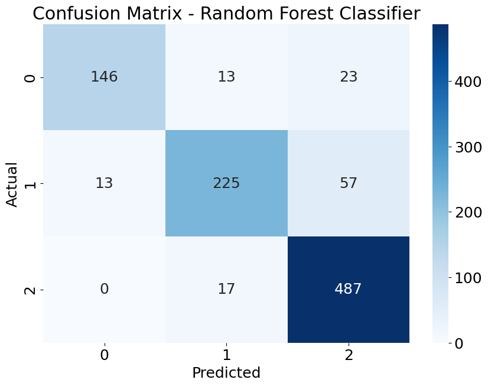

# 2024_ia651_DineshPendyala_SrihariNagineni
# Evaluating Hematological Predictors for Acute Myocardial Infarction (AMI) Forecasting

This project aims to predict the occurrence of heart attacks(AMI) by analysis the hematological predictors using various machine learning models. The analysis is performed using PCA-transformed data and includes the evaluation of multiple classifiers such as Logistic Regression, SVC, Decision Tree, Random Forest, and XGBoost.

## Table of Contents

- [Project Overview](#project-overview)
- [Dataset](#dataset)
- [Models Used](#models-used)
- [Usage](#usage)
- [Results](#results)
- [Conclusion](#conclusion)

## Project Overview

The goal of this project is to build and evaluate machine learning models to predict the likelihood of a heart attack types based on various Hematological parameters of patient features. The analysis involves:

1. Data preprocessing and PCA transformation.
2. Model training using algorithms such as Multinomial Logistic Regression,Support Vector Classifier(OVR),Decision Tree  Classifier,Random forest classifier and Extreme Gradient Booster.
3. Evaluate the performance of the models using Stratified K-Fold Cross-Validation.
4. Model evaluation using metrics like accuracy, precision, recall, F1-score, and ROC-AUC.
5. Visualization of results.

## Usage

1. Open the Jupyter Notebook `IA651_Project_HeartAttack.ipynb`.
2. Ensure the dataset is loaded correctly as `pca_df` and `y`.
3. Run the notebook cells sequentially to execute the analysis.

## Dataset

The dataset used for this project is focused on predicting the occurrence and type of Acute Myocardial Infarction (AMI). The dataset contains hematological parameters and is sourced from [\[Mendeley Data - Heart Disease\]](https://data.mendeley.com/datasets/m482gb564t/1) . The dataset includes the following fields:

- **Age**: Patient's age.
- **WBC**: White Blood Cell count.
- **RBC**: Red Blood Cell count.
- **HGB**: Hemoglobin levels.
- **LY**: Lymphocytes count.
- **MO**: Monocytes count.
- **NEU**: Neutrophils count.
- **BA**: Basophils count.
- **EO**: Eosinophils count.
- **AMI_Type**: The type of Acute Myocardial Infarction (target variable).

This dataset is useful for predicting AMI types based on hematological parameters, which can be vital for early diagnosis and treatment.

## Prediction Objective

The main goal of this project is to predict whether a patient has AMI and, if so, determine the type of AMI using various hematological parameters. This prediction can be used in clinical settings to quickly identify patients at risk and provide timely interventions, potentially saving lives.

## Process Overview

### Project Narrative

During the project, various iterative approaches were employed. Initial attempts involved using simple models, which provided insights into the data but lacked accuracy. Subsequent steps included feature engineering, hyperparameter tuning, and experimenting with different models to improve performance. Some missteps included overfitting on the training data and having to pivot to different models based on validation metrics.

### Exploratory Data Analysis (EDA)

- **X Variables**: Age, WBC, RBC, HGB, LY, MO, NEU, BA, EO.
- **Y Variable**: AMI_Type.
- **Problem Type**: Classification.
- **Number of Observations**: 981.
- **Number of Features**: 25.

### Features

The dataset includes the following features (columns):

### Target Variable

The target variable (`y`) is: **sub-type** which contains 3 classes encodes as 0 - STEMI , 1-Non-STEMI and 2 - Control. where STEMI is ST-Segment Elevation Myocardial Infarction (STEMI) “Classic” heart attack refers to Complete and prolonged occlusion of an artery of the heart and 1-Non-STEMI is Non-ST-Segment Elevation Myocardial Infarction (NSTEMI) refers to 
Minor artery of the heart is completely blocked OR major artery of the heart is partially blocked

#### Feature Distribution

- **Age**: 

  
  
  

- **Gender**:

  

- **AMI_Type**:

  

- **Distribution of Continuous Variables**:

  

  

#### Correlation Analysis

A correlation analysis revealed strong correlations between certain features, such as [describe any notable correlations]. A correlation heatmap/chart is provided below:

#### Feature Importance

All features were initially considered for the model. Feature importance analysis helped in refining the feature set to those most predictive of AMI types.

### Feature Engineering

Feature engineering involved:
- Label encoding for categorical features.
- Creation of new features by combining existing ones where it made clinical sense.
- Advanced encoding techniques were also explored.

### Principal Component Analysis (PCA)

PCA was performed to reduce the dimensionality of the dataset and to visualize the variance explained by each component. The following chart shows the explained variance by each principal component:

The PCA results indicated that 89 percentage of variance explained by the top 11 components, suggesting that these components capture the majority of the variance in the dataset. This helped in understanding the underlying structure of the data and in improving model performance.

### Model Fitting

#### Train/Test Split

The dataset was split into training and testing sets using an 80/20 ratio. Care was taken to avoid data leakage by ensuring the splits were random.

#### Model Selection

Several models were evaluated, including:
- Logistic Regression
- Support Vector Machines (SVM)
- Decision Trees and Random Forests
- Extreme Gradient Boosting

The selection process was driven by model performance on validation metrics.

#### Hyperparameter Tuning

Grid Search and Cross-Validation were used to optimize hyperparameters for each model, ensuring the best performance. Specifically, Stratified K-Fold Cross-Validation was used to ensure that each fold of the dataset had the same proportion of observations with each class label, thus maintaining the distribution of the AMI types.

### Validation and Metrics

The following metrics were considered:
- Accuracy
- Precision
- Recall
- ROC-AUC

### Consolidated Model Metrics

| Model                     | Accuracy Score | Balanced Accuracy Score | Precision                   | Recall                      | F1 Score                    | Support |
|---------------------------|----------------|-------------------------|-----------------------------|-----------------------------|-----------------------------|---------|
| Logistic Regression       | 0.701325       | 0.631552                | 0: 0.65, 1: 0.56, 2: 0.78   | 0: 0.53, 1: 0.46, 2: 0.90   | 0: 0.58, 1: 0.51, 2: 0.83   | 981     |
| SVC                       | 0.706422       | 0.631118                | 0: 0.66, 1: 0.56, 2: 0.78   | 0: 0.49, 1: 0.49, 2: 0.91   | 0: 0.56, 1: 0.52, 2: 0.84   | 981     |
| Decision Tree Classifier  | 0.788991       | 0.765467                | 0: 0.74, 1: 0.70, 2: 0.86   | 0: 0.71, 1: 0.74, 2: 0.85   | 0: 0.72, 1: 0.72, 2: 0.85   | 981     |
| Random Forest Classifier  | 0.874618       | 0.843727                | 0: 0.92, 1: 0.88, 2: 0.86   | 0: 0.80, 1: 0.76, 2: 0.97   | 0: 0.86, 1: 0.82, 2: 0.91   | 981     |
| XGBoost                   | 0.943935       | 0.934123                | 0: 0.92, 1: 0.94, 2: 0.96   | 0: 0.92, 1: 0.91, 2: 0.97   | 0: 0.92, 1: 0.92, 2: 0.96   | 981     |

Here are the confusion matrices for the five models:

- **Logistic Regression**:

  

- **Support Vector Machines (SVM)**:

  

- **Decision Trees**:

  

- **Random Forest (RFC)**:

  

- **Gradient Boosting Classifier**:

  

These confusion matrices highlight the strengths and weaknesses of each model in classifying the AMI types.

- ### ROC-AUC Curves

#### Feature Importance 

- **Feature Importance of Xtreme Gradient Boosting Classifier**:

#### Original features contributing to PCA Components

Top feature names contributing to PC2:
['NEU', 'NEU/LY', 'WBC', 'LY/MO', 'MO', 'PLT/LY', 'Gender', 'HGB', 'MPV/LY', 'HCT']

Top feature names contributing to PC6:
['PDW ', 'RDW-SD', 'MCHC', 'MPV', 'MCV', 'HCT', 'EO', 'PCT', 'MPV/LY', 'RDW-CV']

Top feature names contributing to PC1:
['HGB', 'HCT', 'PLT/LY', 'LY', 'MPV/LY', 'RBC', 'NEU/LY', 'Gender', 'Age', 'MCHC']

#### Prediction Examples

- Below are the prediction examples of the random samples and its prediction done for extreme gradient booster classifier and compared with the prediction captured in y_pred_XGB.

#### Synthesized Predictions

### Overfitting/Underfitting

Efforts were made to identify and mitigate overfitting/underfitting. Techniques such as cross-validation, regularization, and pruning were applied where necessary.

### Production

For deployment, it is crucial to ensure that the model is regularly updated with new data to maintain its accuracy. Monitoring for model drift and performance in a real-world setting is also recommended.

### Going Further

To improve the model:
- Collect more data to enhance the training set.
- Include additional features that might provide more insights.
- Experiment with more complex models and feature engineering techniques.

## Conclusion

From the results of all five models, XGBoost exhibits the highest accuracy compared to the rest. XGBoost is the most optimized classifier for this multinomial classification problem. According to the ROC-AUC curve, the AUC values of XGBoost are equal to 1, indicating perfect performance. The macro average ROC-AUC, which reflects the average performance of the classifier across all classes with equal weight, shows that XGBoost classifies all three classes perfectly.

---

